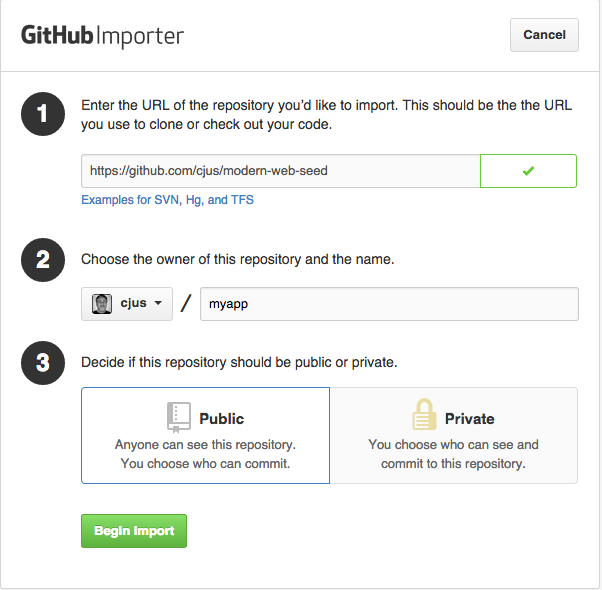
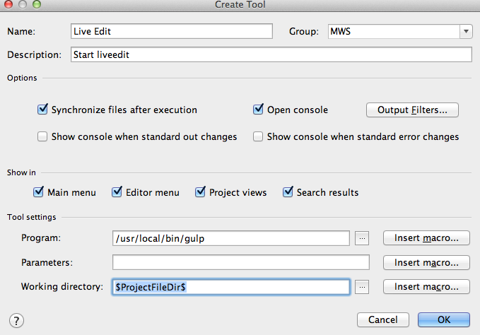
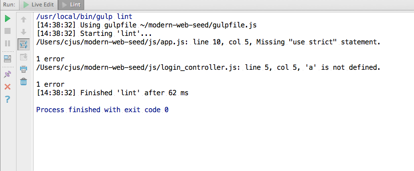

[Return to document root](README.md)

## You're now ready to customize the seed app

You're not ready build your own application based on the Modern web seed app. You have two ways to go about that: automated and manual methods.

### Automated prep

Use the Github Importer to import MWS and create a new project repo. [https://import.github.com/new](https://import.github.com/new)

It's the easiest way of using MWS to create your own app under your github account.



### Manual prep

The automated prep is is the easiest way to get started.  You can however, use the following steps to manual prepare MWS for your own use:

* Delete the .git folder. From within the project root use: `rm -rf .git` 
* Use `git init` to create a new folder and move the seed file there, or rename the seed app folder.
* Replace the web files with your own project files.  
* Add and remove dependencies using bower.

## Understanding the intended directory structure

Here is a brief description of the directory structure how how it's intended to be used.  You can customize it to your liking but it will require you to make changes to the index.html and gulpfile.js files.

```
├── LICENSE                         Project license - can you say free?
├── README.md                       This readme file
├── bower.json                      bower file listing required JavaScript modules (such as Angular, jQuery and more)
├── css                             Folder for you CSS files. Note Sass files will be moved here on compile
│   └── styles.css                  Sample "compiled" Sass file
├── dist                            Distribution folder. Running `gulp dist` will compile your site here
├── fonts                           Font folder. Loaded with Bootstrap3 fonts
├── gulpfile.js                     The Gulp configuration file
├── images                          A folder for your images
├── index.html                      Index.html file
├── js                              Folder for your JS file, but does contain other file not managed by Bower
│   ├── app.js                      App js file containing Angular app module and route
│   ├── iebs                        IE Bullshit - enough said
│   │   ├── es5-shim.min.js
│   │   ├── json3.min.js
│   │   └── respond.min.js
│   ├── login_controller.js         Sample controller for mock login page
│   └── vendor                      Vendor folder for JS modules not managed by Bower
│       └── modernizr.js            Modernizr - note used by this project to resolve no_js class in index.html
├── karma.config.js                 Karma test runner configuration file
├── package.json                    Node NPM file listing required packages
├── robots.txt                      Sample robots.txt file
├── scss                            Folder for Sass files
│   └── styles.scss                 Sample scss file
├── spec                            Folder for Jasmine BDD specs 
│   └── simple-spec.js              Sample spec file
└── views                           The V in MVC, a folder for your views
    └── login_view.html             Sample view
```

## Working on your project with live reload

Live reload is a feature which automatically refreshes your web browser when you change your web files.

```shell
$ gulp
```

You should see:

```    
[14:22:11] Using gulpfile ~/gulpfile.js
[14:22:11] Starting 'watch'...
[14:22:11] Finished 'watch' after 12 ms
[14:22:11] Starting 'connect'...
[14:22:11] Server started http://localhost:8080
[14:22:11] LiveReload started on port 35729
[14:22:11] Finished 'connect' after 88 ms
[14:22:11] Starting 'default'...
[14:22:11] Finished 'default' after 11 μs
```

Open your web browser at http://localhost:8080 to view your application. Changes you make to your html, css, scss, javascript files should cause a browser reload 

## SASS support

Place your files in the scss folder and use a gulp task to compile to CSS.

```shell
$ gulp sass
```

Note that if you're running in live reload mode then your sass/scss files are automatically processed as you make changes.

The modern-web-seed doesn't just support SASS - it expects that you're using it to manage your project CSS needs. Don't update the files in the css folder as they'll be overwritten every time `gulp sass` or `gulp dist` is executed.  If you don't want to use SASS you can remove support for it by editing your gulpfile.js.

## Support for Modernizr

There is a modernizr.js file in the js/vendor folder. This version of modernizr is loaded by the index.html and is intended to be a placeholder.  Visit the [modernizr](http://modernizr.com/download) site to create your own custom version. 

## Keeping your code bee-e-u-tea-full

MWS includes a `.jsbeautifyrc` file containing defaults for js-beautify.  By default, the included gulpfile.js does not automatically run js-beautify on your code. You need to do this manually.

    $ gulp js-beautify

If you want this to happen automatically you can modify the following line or otherwise edit your custom gulpfile.js.

In gulpfile.js change:

     gulp.task('lint', function() {

To:

    gulp.task('lint', ['js-beautify'], function() {

Now when lint is run it first runs js-beautify.  This ensures that your code is already cleaned *before* the linter looks at it.

See https://github.com/beautify-web/js-beautify for more information.

## Creating a distribution for deployment

When you're ready to deploy your project you can run the following command to compile (sass), compress images, HTML, CSS and JavaScript files into concatenated web efficient files.

```shell
$ gulp dist
```

Your project will be built and placed in the `dist` folder where it can be deployed to your remote web server.

Keep in mind that every time you run `gulp dist` the contents of the dist folder are deleted and recreated!  Do not add file into the dist folder it's only intended to host the most recent build.

## Running tests with Karma and Jasmine

Inside of the spec folder is a sample test file. 

Start the Karma test runner:

```shell
$ npm test
```

That should launch a copy of Chrome and execute the spec test. As the specs are changed the results appear in the terminal window where Karma was started.

## Creating build releases

Your current app version is stored in a file called VERSION.  You can simply run the `release.sh` shell script to update your apps version.

	$ ./release.sh

This updates the VERSION file and creates a new release version on your project's git repo.	

## Angular UI Bootstrap or Angular Strap?

Which Angular friendly UI Bootstrap component framework you use is up to you.  This project uses AngularUI but you can easily switch to AngularStrap with these easy steps.

In the index.html file swap the comments for these lines:

```
<!--<script src="bower_components/angular-strap/dist/angular-strap.min.js"></script>-->
<!--<script src="bower_components/angular-strap/dist/angular-strap.tpl.min.js"></script>-->
<script src="bower_components/angular-bootstrap/ui-bootstrap.min.js"></script>
<script src="bower_components/angular-bootstrap/ui-bootstrap-tpls.min.js"></script>
```

In the js/app.js file swap the comments for these lines:

```
//angular.module('app', ['ngRoute', 'mgcrea.ngStrap'])
angular.module('app', ['ngRoute', 'ui.bootstrap'])
```

Once you've decided which to use you can delete the commented lines and delete the branch in bower_components for the framework you're not using.
Also make sure to update your bower.json file by removing the line for the framework you don't need.

## Tips for WebStorm users

### Enable JSHint

Take advantage of JS Linting and the included .jshintrc file while editing in WebStorm.

Under Preferences / Project Settings / JavaScript / Code Quality Tools

* Disable JSLint
* Enable JSHint and make sure to check the "Use config files" checkbox to use the supplied project .jshintrc file.

See the [JSHint documentation](http://www.jshint.com/docs/) for information about configuring the .jshintrc to your own liking.

> Remember you can always run `gulp lint` for an on demand scan of your JS files.

### Speed-up WebStorm during searches
 
Under Preferences / Project Settings / Directories

Exclude: 
 
* .idea
* node_modules
* bower

### Add common workflow commands to your IDE
 
Under Preferences / Project Settings / IDE Settings / External Tools

You may add commands you use during your workflow. In the example below I added a command to start live edit.   



You can proceed to add other useful command by adding any of the following into the Parameters field shown above:
 
Feature     |   Description   
---         |   ---
clean       |   Delete the contents of the dist folder
dist        |   Builds a distribution version of your site
lint        |   Run JSHint against your JS files
sass        |   Compile your scss files
image       |   Compress your images (adds compressed version to the dist/images folder

You can then select commands from the WebStorm Tools menu.

One nice benefit is that once you execute commands you can rerun them by clicking on the green play button:



Finally, you can even add key bindings via: Preferences / Project Settings / IDE Settings / Keymap
and selecting the `External tools` branch.

## Troubleshooting guide

The modern-web-seed should run using the instructions provided with the project.  Here are some issues you may encounter and how you might work through them.

### I get errors when I build using `gulp dist`
* Don't forget that MWS has automatic lint support which scans your code for common errors. Scroll through the error output and make sure that the errors you're seeing are not in the linting phase ;-)
* You may have received bad files during npm install or bower install.  Try deleting the `bower_components` and `node_modules` folders and rerunning the steps in the [README.md](README.md) file.
* You may have encountered file permission issues.  Try deleting the `node_modules` folders and rerunning using the sudo command.

### I get an error message when I run `gulp` or `gulp watch`
* Make sure you're not running another process which is using port 8080 and/or 9876.


[Return to document root](README.md)

